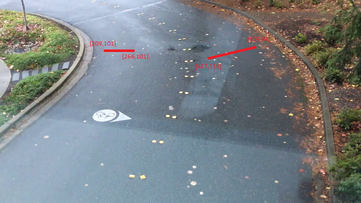
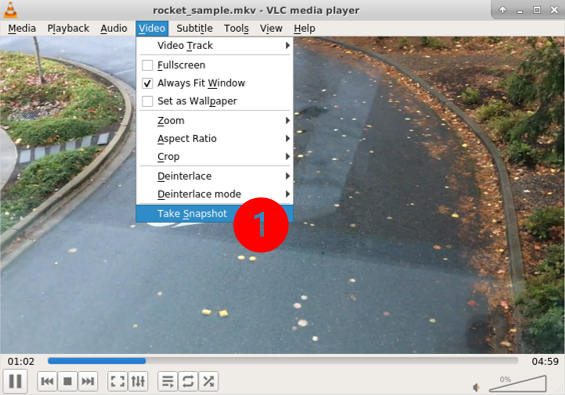
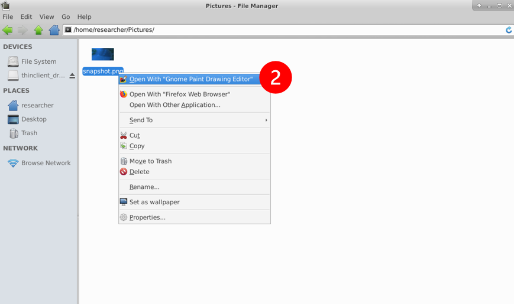
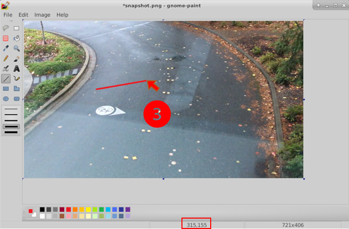

# Configure lines of interest

Rocket enables counting and alerting when objects cross lines of interest in the frame, e.g., cars entering a driveway or people walking into the shop. Rocket takes a line-file as input for its line-based counting/alerting and cascaded DNN calls. 

## Line format and specification 

Each line in the file defines a line-of-interest with the following format. The fields in each line are separated by tabs.

	`<line_count_name> <number_of_lines> <x_1> <y_1> <x_2> <y_2> <overlap_threshold>`

The fields signify the following:
* line_count_name - unique string to name the line.
* number_of_lines - this must be always set to 1.
* x_1, y_1, x_2, y_2 - the X and Y coordinates of the line's endpoints.
* overlap_threshold - this is the fraction of the line that the object is expected to cover for the count/alert to be triggered.  

Here is a [sample line configuration file](https://aka.ms/linesample) manually created for [rocket-sample.mkv](https://aka.ms/lva-rocket-videosample) with two lines of interest. The two lines are also shown in the picture below, which is a frame from the `rocket-sample.mkv` video. The first line in the [sample configuration file](https://aka.ms/linesample), for instance, lists the coordinates of the two endpoints of the line `(209, 101)` and `(266, 101)`. A count will be triggered when the object's overlap with this line is at least `0.3` of the line's length.  

An easy way to mark the lines is to take a "snapshot" from the video, say using VLC, mark the lines on the snapshot frame, and then list the coordinates and parameters of the line in the format specified above to create the line-file. We include helpful snapshots below for marking the lines using VLC and Gnome Paint Drawing Editor on Ubuntu. On Windows, similar steps can be taken by VLC and Paint.    

Taking snapshot on VLC  
  

Opening the snapshot from Pictures folder  
  

Drawing lines in Gnome Paint Drawing Editor. Note the coordinates at the bottom as the cursor moves.  
